<div align="center">



<br/>


</div>

---


```python
root@thedigitalbeni:~$ cat about.json

{
  "name"       : "[YOUR NAME]",
  "age"        : [YOUR AGE],
  "role"       : ["Cybersecurity Student",
                  "Python Developer",
                  "Freelancer"],
  "os"         : ["Ubuntu (primary)",
                  "Kali Linux",
                  "Windows"],
  "building"   : "[WHAT YOU'RE WORKING ON]",
  "platforms"  : ["TikTok", "YouTube"],
  "goal"       : "Wealthy. Free. Impactful.",
  "status"     : "OPEN_TO_WORK"
}
```

<br clear="right"/>

---

### `> ARSENAL`


---

### `> SYSTEM STATS`

<div align="center">


</div>

---

### `> CONTRIBUTION MATRIX`

<div align="center">


</div>

---

### `> ESTABLISH CONNECTION`

<div align="center">

[](YOUR_TIKTOK_URL)
[](YOUR_YOUTUBE_URL)
[](YOUR_LINKEDIN_URL)
[](YOUR_TWITTER_URL)
[](YOUR_UPWORK_URL)

</div>

---

<div align="center">


